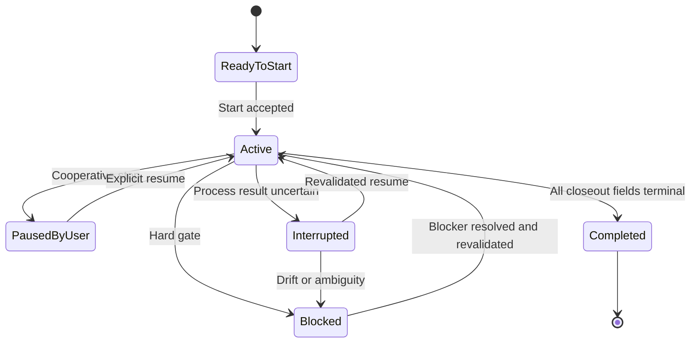
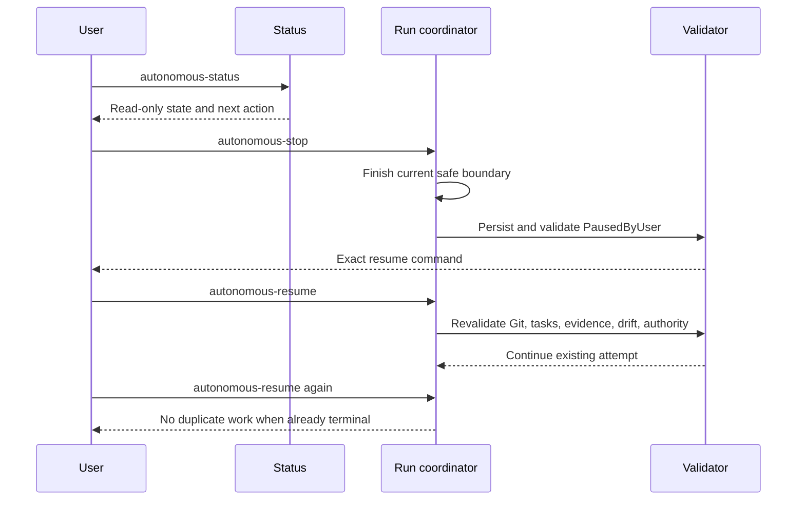

# Lebenszyklus und Operationen / Lifecycle and Operations

[Handbuch / Manual](README.md) | [Evidence und Closeout / Evidence and closeout](evidence-and-closeout.md)

## Zustandsmodell / State model

**Textalternative DE:** Ein startbereiter Lauf wird nach akzeptiertem Auftrag
`Active`. Ein kooperativer Stop fuehrt zu `PausedByUser`; ein unklar beendeter
Prozess zu `Interrupted`; ein Hard Gate zu `Blocked`. Nur ein ausdrueckliches
Resume nach vollstaendiger Revalidierung fuehrt zurueck zu `Active`.
`Completed` ist erst nach terminalem Closeout und finaler Validierung erlaubt.

**Text alternative EN:** An accepted start moves a ready run to `Active`. A
cooperative stop produces `PausedByUser`; an uncertain process result produces
`Interrupted`; a hard gate produces `Blocked`. Only explicit resume after full
revalidation returns the run to `Active`. `Completed` requires terminal
closeout and final validation.

## Status, Stop und Resume / Status, stop, and resume

**Textalternative DE:** Status liest nur. Stop verhindert neue Arbeit und
wartet auf einen sicheren Grenzpunkt. Danach wird `PausedByUser` validiert.
Resume prueft Git, Tasks, Evidence, Drift und aktuelle Berechtigung und setzt
den bestehenden Versuch fort. Ein erneutes Resume wiederholt keine bereits
belegte terminale Operation.

**Text alternative EN:** Status only reads. Stop prevents new work and waits
for a safe boundary, then validates `PausedByUser`. Resume revalidates Git,
tasks, evidence, drift, and current authority before continuing the existing
attempt. A second resume does not repeat an already proven terminal operation.

## Phasen-Routing / Phase routing

Ein Prozessende mit Code 0 ist notwendig, aber nicht hinreichend. Der Wrapper
setzt die Operation vor dem Start auf `NeedsRevalidation`. Erst ein passendes
strukturiertes Resultat mit Outcome `Completed`, vollstaendigen Taskzahlen,
erfuellten Gates und gueltigem Payload-Hash schliesst die Phase ab. Fehlende
oder widerspruechliche Evidence fuehrt zu `Blocked` und verlangt einen
expliziten Resume-Audit.

*A zero process exit is necessary but insufficient. Before launch the wrapper
sets the operation to `NeedsRevalidation`. Only a matching structured result
with completed tasks, satisfied gates, and a valid payload hash closes the
phase. Missing or contradictory evidence becomes `Blocked` and requires an
explicit resume audit.*

`model-routing.json` ordnet Preset-Kommandos stabilen Rollen zu. Wenn mehrere
aktive Presets dasselbe Kommando klassifizieren, gewinnt die staerkste Rolle:
`frontier-reasoning`, `coding-review`, `long-running-implementation`,
`fast-mechanical`, danach `script-only`. Konkrete Provider- und Modellnamen
stehen nur in einer lokalen Runner-Konfiguration.

Ein Modellwechsel ist nur an einer persistierten Phasengrenze erlaubt. Der
vorherige Prozess muss erfolgreich beendet sein; seine Metadaten und das
SHA-256-gebundene Ergebnis werden im Run-State gespeichert. Erst danach startet
`invoke-autonomous-model-phase.*` einen neuen Prozess fuer die naechste Phase.
`script-only` wird direkt deterministisch ausgefuehrt und darf keinen
Modellprozess starten. Ein fehlendes oder mehrdeutiges Profil, ein fehlendes
Modell beziehungsweise Reasoning-Level oder ein fehlschlagender Preflight setzt
den Lauf auf `Blocked`.

`model-routing.json` maps preset commands to stable roles. If several active
presets classify the same command, the strongest role wins:
`frontier-reasoning`, `coding-review`, `long-running-implementation`,
`fast-mechanical`, then `script-only`. Concrete provider and model names exist
only in local runner configuration.

A model switch is allowed only at a persisted phase boundary. The previous
process must have completed successfully, and its metadata plus SHA-256-bound
result are stored in run state before `invoke-autonomous-model-phase.*` starts
a new process for the next phase. `script-only` runs deterministically without
a model process. A missing or ambiguous profile, missing model or reasoning
effort, or failed preflight sets the run to `Blocked`.

## Deutsch

### Status

`/speckit.autonomous-status` ist immer read-only. Er darf keine Datei erzeugen,
keinen Branch wechseln und keinen Lauf starten. Er rekonstruiert den Zustand
aus Run-State, Git, Tasks und Evidence.

Moegliche Ergebnisbegriffe:

| Begriff | Bedeutung |
|---|---|
| `ReadyToStart` | Kein aktiver Lauf; Voraussetzungen sind erfuellt |
| `ReadyToResume` | Unterbrochener Lauf ist identifiziert |
| `PausedByUser` | Bewusster Stop; explizites Resume erforderlich |
| `Interrupted` | Prozess oder Operation ohne belastbares Ergebnis |
| `Blocked` | Drift, Konflikt, fehlende Evidence oder Hard Gate |
| `Completed` | Alle anwendbaren Abschlussbedingungen erfuellt |
| `NoActiveRun` | Kein eindeutiger Lauf vorhanden |

### Kooperativer Stop

`/speckit.autonomous-stop` ist kein Prozess-Kill. Nach Eingang der Anforderung
wird keine neue Aufgabe, Validierung oder Remote-Aktion gestartet. Am naechsten
sicheren Grenzpunkt werden Arbeitsbaum, letzte belastbare Operation, unsichere
Operation und naechster exakter Schritt gespeichert.

### Resume

`/speckit.autonomous-resume` setzt nur einen vorhandenen Lauf fort. Vor jeder
Mutation prueft es:

1. Feature- und Branch-Identitaet,
2. State-Schema und akzeptierte Artefakt-Hashes,
3. Tasks und Git-Historie,
4. eigene und fremde Arbeitsbaum-Aenderungen,
5. Preset- und Governance-Drift,
6. aktuelle lokale und Remote-Berechtigung,
7. letzte belastbare beziehungsweise unsichere Operation.
8. Routing-Katalog, lokales Runner-Profil, Modell-Preflight und Hash der letzten
   abgeschlossenen gerouteten Phase.

Bereits belegte Arbeit wird wiederverwendet. Nur unbewiesene oder
unvollstaendige Operationen werden erneut ausgefuehrt.

### Retrospektive

`/speckit.autonomous-retrospective` liest einen abgeschlossenen Lauf und
klassifiziert Erkenntnisse als `Promote`, `ObserveAgain`,
`RejectProjectSpecific`, `Superseded` oder `NoPromotion`. Eine Retrospektive
erteilt keine Berechtigung, ein anderes Repository oder Preset zu aendern.

## English

### Status

`/speckit.autonomous-status` is always read-only. It must not create a file,
switch a branch, or start a run. It reconstructs effective state from run
state, Git, tasks, and evidence.

| Term | Meaning |
|---|---|
| `ReadyToStart` | No active run and prerequisites are satisfied |
| `ReadyToResume` | An interrupted run is identified |
| `PausedByUser` | Deliberate stop; explicit resume required |
| `Interrupted` | Process or operation has no trustworthy result |
| `Blocked` | Drift, conflict, missing evidence, or hard gate |
| `Completed` | Every applicable completion condition is satisfied |
| `NoActiveRun` | No unambiguous run exists |

### Cooperative stop

`/speckit.autonomous-stop` is not a process kill. After the request, no new
task, validation, or remote action starts. At the next safe boundary, it stores
worktree ownership, last trustworthy operation, uncertain operation, and next
exact action.

### Resume

`/speckit.autonomous-resume` continues only an existing run. Before mutation it
checks feature and branch identity, schema and hashes, tasks and Git history,
owned and unrelated changes, preset and governance drift, current authority,
the last trustworthy or uncertain operation, routing catalog, local runner
profile, model preflight, and the last completed routed-phase hash.

Verified work is reused. Only an unproven or incomplete operation is retried.

### Retrospective

`/speckit.autonomous-retrospective` reads a completed run and classifies
learning as `Promote`, `ObserveAgain`, `RejectProjectSpecific`, `Superseded`,
or `NoPromotion`. It does not authorize changes to another repository or
preset.
