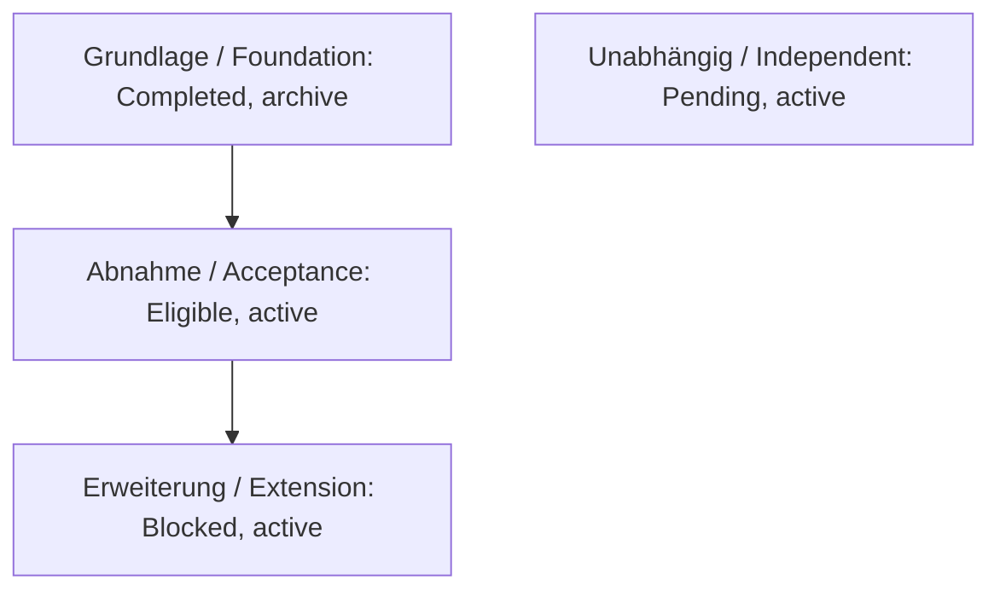

# Mermaid und Abschlussberichte / Mermaid and completion reports

## Zweck und Verbindlichkeit / Purpose and authority

Diese Projektregel gilt für neue Lastenhefte und vollständig abgeschlossene
Spec-Kit-Feature-Läufe, manuell begleitet wie autonom. Owner ist der
Repository-Maintainer. Anforderungen und Evidence bleiben die verbindlichen
Quellen. Diagramme und Berichte erteilen keine Ausführungs-, Merge- oder
Bypass-Berechtigung. Bestehende Intakes und abgeschlossene Berichte werden
nicht rückwirkend neu geschrieben.

*This project rule applies to new requirements intakes and completed Spec Kit
feature runs, whether assisted or autonomous. The repository maintainer owns
it. Requirements and evidence remain authoritative. Diagrams and reports grant
no execution, merge or bypass authority; historical artifacts are not rewritten.*

## Mermaid als Text-Ergänzung / Mermaid as a text supplement

Ein Lastenheft MUSS bei fachlich hilfreichen Abläufen, Zuständen oder
Abhängigkeiten ein Mermaid-Diagramm als lesbaren `mermaid`-Codeblock im
versionierten Markdown enthalten. Für einfache Inhalte genügt eine kurze
begründete Angabe „Diagramm nicht erforderlich“. Diagramme ersetzen keine
Anforderungen. Jeder Codeblock erhält eine kurze Textalternative mit derselben
wesentlichen Aussage. Status, Kanten und Sicherheitsgrenzen müssen ohne Farbe,
Maus und grafische Darstellung verständlich bleiben.

Knoten verwenden stabile, lesbare IDs und kurze Labels. Eine Legende erklärt
Kanten. Reihenfolge allein begründet keine Abhängigkeit. Bei Intake-Serien
stammen Mitglieder, Lifecycle, Status und verbindliche Abhängigkeiten aus dem
aktuellen Manifest; unabhängige Mitglieder werden ohne erfundene Kanten gezeigt.
`Eligible` bedeutet keine Ausführungsfreigabe. Datum und Quellenlink machen
Momentaufnahmen erkennbar. Diagramme werden bei Änderungen ihrer Quelle geprüft.
Keine externen Bilder, Skripte, HTML-Interaktionen oder Renderer-Dienste sind
für die Nutzung erforderlich. Renderprüfung erfolgt lokal oder in vorhandener
Repository-CI; vertrauliche Inhalte werden nicht an öffentliche Editoren gesendet.

*Use a readable, versioned Mermaid Markdown block whenever workflows, states or
dependencies benefit from a diagram. Simple intakes may state why none is
needed. Include an equivalent short text alternative and an edge legend; do
not rely on color or graphical rendering. Stable IDs, short labels, source and
snapshot date keep the diagram maintainable. Series diagrams reflect manifest
truth, distinguish ordering from dependency and invent no edges. Eligible does
not grant execution authority. Review diagrams when their sources change; no
external renderer or interactive HTML is required.*

### Beispiel: gemischte Serie / Example: mixed series

Fiktives Beispiel, keine Projektfreigabe. `A --> B` bedeutet: A muss vor B
abgeschlossen sein. / Fictional example; each arrow is a completion prerequisite.

Textalternative: Die Grundlage ist archiviert und abgeschlossen. Als Nächstes
ist die Abnahme vorgesehen; danach kann die Erweiterung folgen. Das vierte
Mitglied hat keine Abhängigkeitskante. Keine dieser Aussagen startet Arbeit.

*Text alternative: the foundation is completed and archived. Acceptance is
preferred next; the extension depends on it. The fourth member is independent.
None of these statements starts work.*

Ein einfaches Lastenheft für eine einzelne Textkorrektur kann stattdessen
festhalten: „Diagramm nicht erforderlich: eine einzelne Änderung ohne Ablauf,
Zustandswechsel oder Abhängigkeit; der Akzeptanzsatz beschreibt sie vollständig.“

*A simple copy correction may state: “No diagram required: one change without a
workflow, state transition or dependency; the acceptance sentence is sufficient.”*

## Abschlussbericht / Completion report

Nach jedem vollständig abgeschlossenen Spec-Kit-Feature-Lauf MUSS der Agent
einen vollständigen, verständlichen Ergebnisbericht in seiner finalen Antwort
anzeigen und im Feature-Verzeichnis als `completion-report.md` versionieren.
Die Vorlage liegt unter `.specify/templates/completion-report-template.md`.
Die Chat-Ausgabe ist kein bloßer Link und keine Liste von Commit-IDs. Deutsche
Ausgabe zuerst, englischer Sprachpartner nach Repository-Vertrag; Zahlen und
Aussagen müssen in beiden Fassungen übereinstimmen.

Einzelne Specify-, Plan-, Status- oder Review-Kommandos lösen keinen vollständigen
Abschlussbericht aus. Pausierte und blockierte Läufe erhalten einen entsprechend
bezeichneten Zwischenbericht; sie werden nicht als abgeschlossen ausgegeben.
Bei mehreren Liefer-PRs entsteht ein zusammenhängender Feature-Bericht. Die
Berichtspflicht startet weder den nächsten Intake noch einen zusätzlichen Lauf.

*After every completed feature run, show the complete readable report in the
final response and version it as completion-report.md in the feature directory.
Use the shared template, not merely a link or commit list. Follow repository
language rules. Individual planning/status/review commands do not trigger a
feature report. Paused or blocked runs receive a clearly labeled interim report.
Multiple delivery PRs share one feature report; reporting starts no new run.*

### Pflichtinhalte und Messgrenzen / Required content and measurement limits

- Ergebnis: konkret erklären, welche Fähigkeit entstanden ist; Produktfunktion,
  Governance, Infrastruktur oder Dokumentation einordnen. Eine Tabelle fasst
  Komponenten, Verhalten und Grenzen zusammen.
- Implementierung und Prüfung: Verträge, wesentliche Komponenten, tatsächliche
  Testbefehle, Plattformen und Ergebnisse mit dauerhaften Quellen verbinden.
  `Pass`, Fehler, nicht ausgeführt und Provider-Ausfall getrennt ausweisen.
- Dokumentation und Governance: Artefakte, abgeschlossene/offene Tasks,
  Documentation-Impact-Entscheidung, Retrospektive und Liefernachweise benennen.
- Umfang: Ausgangs- und Endrevision nennen. Dateien, Additionen/Deletionen und
  Nicht-Merge-Commits aus Git ableiten. Netto-Diff und Brutto-Commitvolumen klar
  unterscheiden; Statistikmethodik des Repositories verwenden. Logik, Adapter,
  Tests, Dokumentation, generierte Evidence und Statistik-Commits erklären,
  ohne Evidence-Zeilen als neue Programmlogik darzustellen. Überlappende Mengen
  nicht addieren. Messbefehle und Ausschlüsse angeben.
- Verlauf: wesentliche Review-Korrekturen, Plattformprobleme und Lieferaufwand
  anhand von Evidence erklären. Git-Wandzeit ist keine aktive Arbeitszeit und
  keine belastbare Zuordnung der Dauer zu Agenten oder Menschen.
- Abschluss: tatsächlicher Liefermodus, PRs, Merge-/Sync-Zustand, Ausnahmen,
  Restbefunde und sichere nächste Aktion. „Nicht erfasst“ beziehungsweise
  „nicht anwendbar“ mit Begründung statt erfundener Werte verwenden.

*Required content: actual outcome and capability table; implementation contracts
and executed tests with platforms; documentation, tasks and governance decisions;
Git-bound change volume distinguishing net diff from gross commit volume and
logic from generated evidence; evidenced delivery difficulties and measurement
limits; actual delivery state, exceptions and remaining findings. Unknown data
is marked not recorded, inapplicable data is justified. Never fabricate timing,
counts, successful gates or approvals. Use stable repository/PR links, not /tmp.*

### Lieferung ohne Berichtsschleife / Delivery without report churn

Der versionierte Bericht wird mit dem regulären Lieferumfang vorbereitet und
nennt seinen tatsächlichen Evidence-Stand. Vor dem Merge darf er den noch
fehlenden Merge-/Sync-Nachweis als ausstehend ausweisen. Die finale Chat-Ausgabe
ergänzt diesen nach erfolgreicher Prüfung; bestehende Closeout-Evidence oder ein
PR-Kommentar halten die finalen IDs fest. Der Bericht verweist auf diesen
stabilen Nachweispfad. Eine unbekannte eigene Commit-ID wird nicht vorgetäuscht.
Allein für selbstreferenzielle IDs oder wiederholte Statistikdarstellung werden
keine weiteren Commits oder leeren Closeout-PRs erzeugt. Fachliche Fehler im
Bericht werden regulär berichtigt und geprüft.

*Prepare the versioned report within normal delivery and declare its evidence
cutoff. Pending merge/sync proof remains pending until verified. The final chat
adds verified delivery details, backed by existing closeout evidence or a PR
comment through stable links. Do not create commits or empty PRs solely for
self-referential IDs or repeated statistics. Correct substantive errors normally.*

## Pflege / Maintenance

Die Level-0-Quelle ist `docs/spec-kit-diagrams-and-completion-reports.md` in
`hindermath/home-baseline`. Projektlokale Ergänzungen bleiben erhalten.
Agent-Anweisungen, Lastenheft-Profil und Berichtsvorlage binden diese Regel.
Spec-Kit-Updates müssen die projektlokalen Vorlagen erhalten; Preset-Pakete
werden dafür nicht verändert. Wiedervorlage: Änderung der Berichtsdaten,
Diagrammquelle, Agent-Oberflächen oder des Update-Verhaltens.

*The canonical shared source is the same document in hindermath/home-baseline.
Preserve project extensions and local templates across Spec Kit updates. Agent
instructions and intake/report templates bind this rule; preset packages are
unchanged. Reevaluate on source, reporting, agent-surface or updater changes.*
